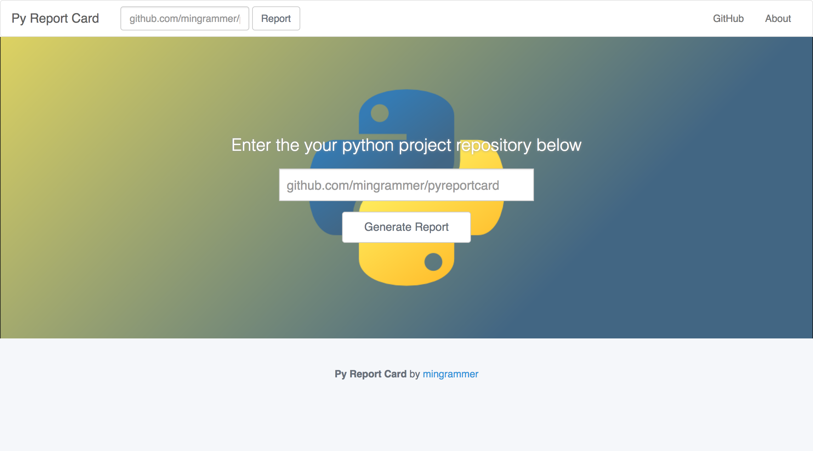
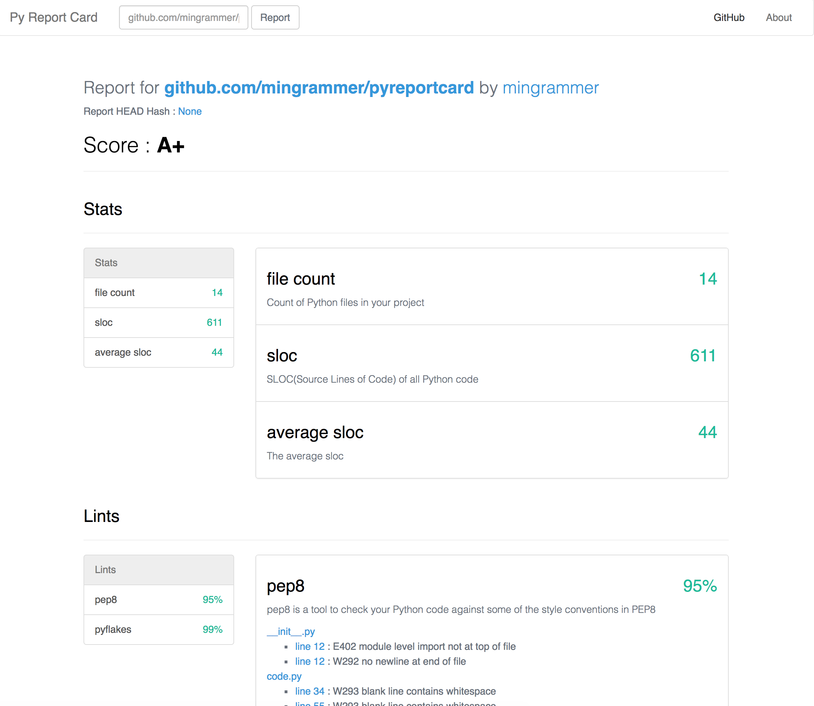

# Python Report Card
> *Inspired by [Go Report Card](https://github.com/gojp/goreportcard)*

A report card for your Python application. This inspects a python project is hosted on Github and analyze the source code quality (PEP8 and Pyflakes), existence of license file, test coverage, and some useful statistics of whole codebase. Then shows its analysis results on web.

You can see our planning for future versions in [here](https://github.com/mingrammer/pyreportcard/projects/1) too.

## ScreenShots





## Features

* [x] Supports checking the code quality using PEP8 and Pyflakes linting tools
* [x] Supports counting the code lines and calculates some stats
* [x] Supports checking the license file
* [ ] Supports calculating the test coverage and shows test results
* [ ] Supports checking the compatibility of Python 2 and 3
* [ ] Supports checking the security issues
* [ ] Supports customizable analyzing using own configuration file
* [x] Provides a grade system
* [x] Provides a pyreportcard web server
* [ ] Serves it as web service
* [ ] Provides ranking system
* [ ] Provides badge link of repository grade

## Install and Run

* Clone this repository.
* Run `pip install -r requirements.txt` to install all dependencies (If you don't have `pip`, install `pip` first)
* Install the [MongoDB](https://www.mongodb.com/) that is used for our backend database.
* You must configure the secret values in `config_secret.py`. Firstly, copy the example secret file to create secret file by `cp config_secret.py.example config_secret.py`, and then fill out the secret values with yours.

```
class SecretConfig:
    SECRET_KEY = '...'

    MONGO_DBNAME = 'reportcard'
    MONGO_HOST = '...'
    MONGO_PORT = ...
    # MONGO_USER = '...'
    # MONGO_PASSWORD = '...'
```

* Run server by `python3 run.py`.
* Go `127.0.0.1:5000` and just use it.

*Note: Now, you can run it on local system only, But we'll provide isolated environments using Docker for installing and running soon.*

## Tests

*Note: We have a test code for only vcs module now. We'll add more tests for all features soon*

```bash
python3 -m unittest tests/test_vcs.py`
```

## Dependencies
* [PEP8](http://pep8.readthedocs.io/en/release-1.7.x/)
* [Pyflakes](https://github.com/PyCQA/pyflakes)
* [Pymongo](https://github.com/mongodb/mongo-python-driver)
* [Flask](https://github.com/pallets/flask)

## License
The content of this project itself is licensed under the Creative Commons Attribution 3.0 license, and the underlying source code used to format and display that content is licensed under the MIT license.
